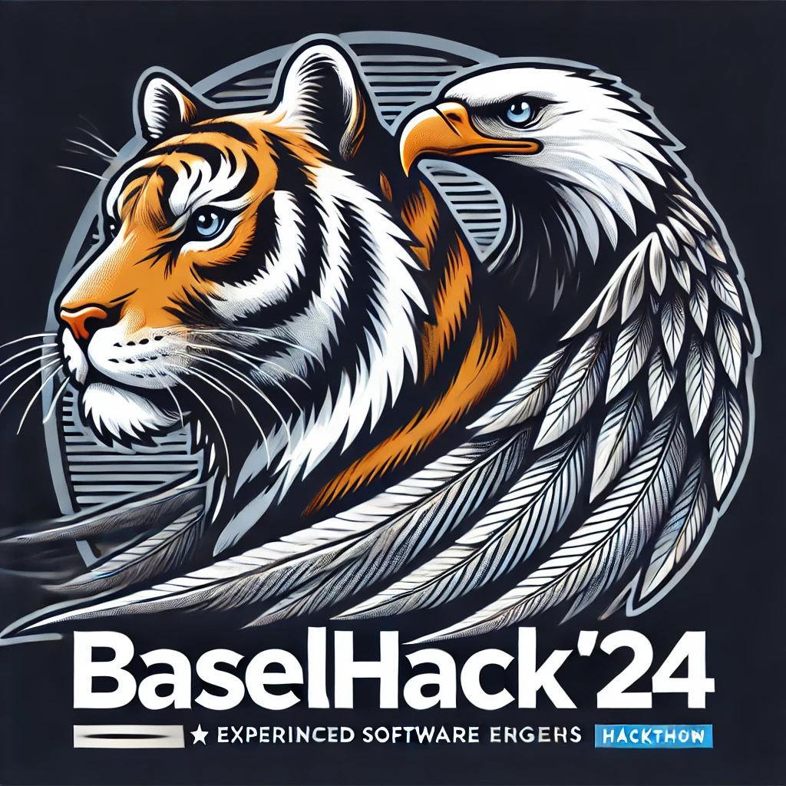

# BaselHack24-EAGER

## 📢 Project Pitch

**Concept:**  
Develop a **media summarization tool** accessible through a **Telegram Bot**, **Chrome Extension**, and **Web App**. Building on the [YouTube Summary with ChatGPT project](https://github.com/kazuki-sf/YouTube_Summary_with_ChatGPT), our approach enhances user control, scalability, and cross-platform accessibility.

**Key Features:**
1. **Claude-Powered Summaries**: Fast, accurate, and cost-effective.
2. **Chrome Extension**: Direct access to summaries on YouTube for seamless use.
3. **Telegram Bot**: Quick, link-based summaries optimized for mobile.
4. **User API Key Support**: Personalized API management for scalability.

**Bonus Vision:**  
A modular API structure to allow multiple AI models (e.g., Claude, GPT) to be integrated, giving users the flexibility to choose or swap models.

**Objective:** Build a high-impact, cross-platform media summarizer balancing feasibility with innovation for a smooth user experience.

## 🎯 Mission: Media Summary Suite

An efficient, accessible media summarizer offering real-time, concise summaries across multiple platforms, focused on simplicity and user control.

---

## 👥 Team Roles

| Role                | Key Focus                                  |
|---------------------|--------------------------------------------|
| 1x Frontend Ninja   | Chrome Extension UI, Web Interface         |
| 1x Backend Master   | Core API Integration                       |
| 1x Full-stack Samurai | Infrastructure & Testing               |
| 1x Bot Specialist   | Telegram Integration                       |
| 1x Creative Warrior | UX/UI Refinement & Polish                  |

---

## 🛠️ Tech Stack

| Component         | Stack               |
|-------------------|---------------------|
| **Backend**       | Node.js + Redis     |
| **Frontend**      | Next.js + ShadCN/UI |
| **Bot**           | Telegram API + Node |
| **AI**            | Claude API          |

---

## ⚔️ Execution Strategy

### Tactical Plan

1. **Backend Foundation**  
   - Modular architecture supporting multiple AIs, with user API key handling.

2. **Chrome Extension UI**  
   - Clean, single-click summary interface directly in YouTube.

3. **Telegram Bot**  
   - Simple link-to-summary feature optimized for mobile use.

4. **Web Application with Analytics**  
   - Dashboard for managing summaries, tracking usage, and reviewing history.

---

## 📅 Timeline

**Day 1**:  
- Complete backend foundation with API integration.
- Begin initial setup of Chrome Extension UI.

**Day 2**:  
- Complete Chrome Extension functionality and conduct user testing.
- Integrate and test the Telegram Bot for smooth operation.

**Day 3**:  
- Final testing and adjustments across all components (Chrome, Telegram, Web App).
- Polish UX/UI for a seamless, professional finish.

---

## 📂 Additional Resources

- **[Claude API Documentation](https://example.com/claude-api)**: Dive into Claude’s summarization capabilities.
- **[Next.js Documentation](https://nextjs.org/docs)**: Learn Next.js for a high-performance frontend.
- **[Telegram Bot API](https://core.telegram.org/bots/api)**: Guide to creating and managing Telegram bots.

---

This is our battle plan. Let’s keep it clean, efficient, and deliver impressive results at BaselHack24.
